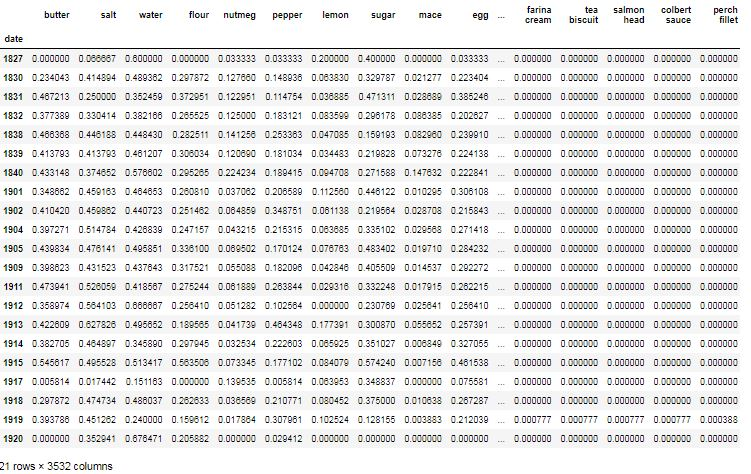
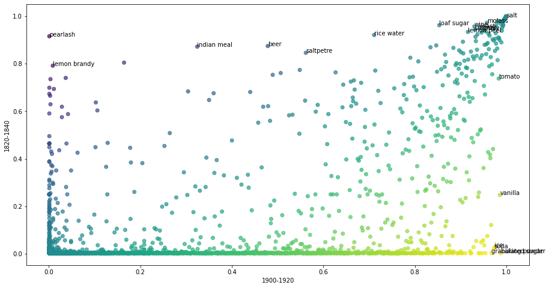

#### Please check week1.ipynb for detailed code and analysis. The following is short analysis to the exercise question.

#### 1. Sampling the recipes between 1820-1840 and 1900-1920:

In the given data, I found the total recipes for considered years are 48032. 
However, between 1820-1840 and 1900-1920, I observed that there is a total of 19 years for which recipes are reported. 
We group those sampled recipes year wise as below:


```py
ingredients = df['ingredients'].str.split(';')

# group all rows from the same year
groups = ingredients.groupby('date')

# merge the lists from the same year
ingredients = groups.sum()

# compute counts per year
ingredients = ingredients.apply(pd.Series.value_counts).fillna(0)

# normalise the counts
ingredients = ingredients.divide(recipe_sscounts, 0)

# filter only required ingredients for 1820-1840 and 1900-1920
edited_rows = ingredients.loc[((ingredients.index >= 1900) & (ingredients.index <= 1920)) | ((ingredients.index >= 1820) & (ingredients.index <= 1840))]
```


#### 2. Feature selection using chi2 statistics 
Chi2 is used for selecting best feature among all feature recipes. I obsered here that "loaf sugar" is mostly used in all the periods of begining of 18th 
century and ending of 19th century with the percent 0.734. Then pearlash, rice water, baking powder, yeast etc., are mostly used recipes in the given period.

```py
pearlash            0.495223
loaf sugar          0.449094
rice water          0.397945
wine                0.385085
baking powder       0.370681
vanilla             0.321912
molass              0.321107
beer                0.317949
yeast               0.314298
currant             0.282046
indian meal         0.271841
lemon peel          0.252384
gravy               0.217980
saltpetre           0.212098
lemon brandy        0.208674
ice                 0.199448
tomato              0.194492
soda                0.191709
granulated sugar    0.176807
salt                0.165199
dtype: float64
```

#### 3. Percentaile of recipes b/w 1900-20 

Below are the percentile of mostly used recipes between ```1900-1920```. Water is heavily used then remaining ones. Then butter, salt etc.,
```py
salt        1.000000
water       0.999167
butter      0.998333
sugar       0.997500
flour       0.996667
egg         0.995833
pepper      0.995000
milk        0.994167
egg yolk    0.993333
onion       0.992500
dtype: float64
```

#### 4. Percentaile of recipes b/w 1820-40 
Below are the percentile of mostly used recipes between ```1820-1840```. In this period salt is mostly used by people then remaining ones recipes... Then water, butter etc ..,
```py
water      1.000000
butter     0.997423
salt       0.994845
sugar      0.992268
flour      0.989691
egg        0.987113
milk       0.984536
pepper     0.981959
nutmeg     0.979381
vinegar    0.976804
dtype: float64
```
#### 5. Graphs between 1820-40 and 1900-20
From the below graph I observed that ```perlash, indian meal, beer, salt petre``` is frequently used in the period ```1820-1840``` than in 1900-1920. 
```vanila, ice, soda, baking powder``` etc., are mostly used in the period ```1900-1920```. ```Tomato``` is mostly used in the ```early 19th century``` and ice water 
 ```1820-1840```. ```Loaf sugar, lemon water, salt, wine, molass, yeast, paste, lemon peel, currant``` are almost used heavily in both periods.

